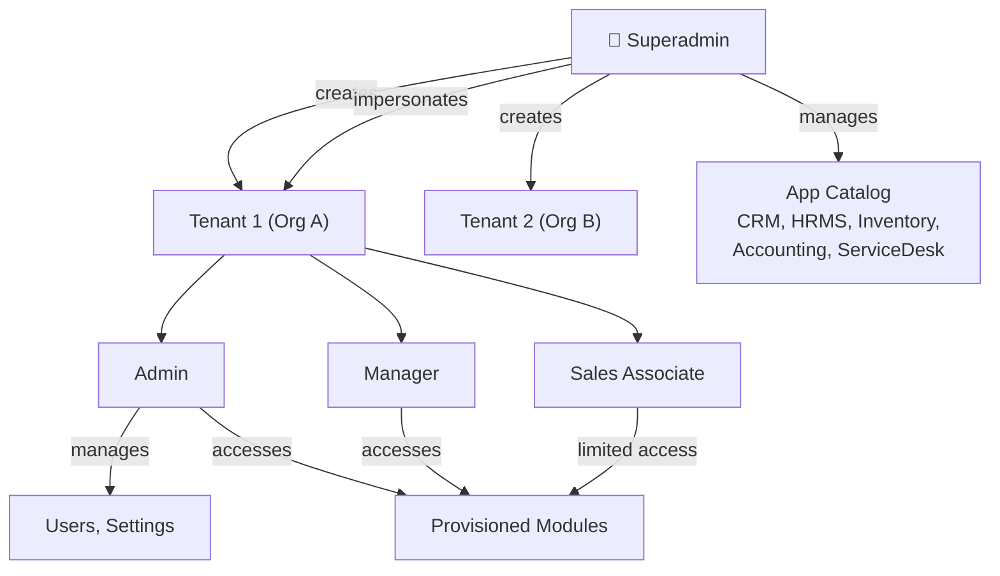

# SAR Workforce — Product Requirements Document (PRD)
## For TestSprite Automated Testing

**Application Name:** SAR Workforce  
**Version:** Production (June 2026)  
**Application Type:** Multi-Tenant SaaS Enterprise Resource Planning  
**Frontend:** React SPA (Vite + React Router)  
**Backend:** PHP REST API (MySQL)  
**Base URL:** `https://<domain>/lead/` (configurable via `basePath`)  
**API Base URL:** `https://<domain>/lead/api/`  

---

## Table of Contents

1. [Application Overview](#1-application-overview)
2. [User Role Hierarchy](#2-user-role-hierarchy)
3. [Authentication & Session Management](#3-authentication--session-management)
4. [Module 0 — Superadmin Console](#4-module-0--superadmin-console)
5. [Module 1 — Leads & Sales Intelligence (CRM)](#5-module-1--leads--sales-intelligence-crm)
6. [Module 2 — Human Resource Management (HRMS)](#6-module-2--human-resource-management-hrms)
7. [Module 3 — Smart Inventory & Warehouse Control](#7-module-3--smart-inventory--warehouse-control)
8. [Module 4 — Double-Entry Financial Ledger (Accounting)](#8-module-4--double-entry-financial-ledger-accounting)
9. [Module 5 — Service Desk & Ticketing](#9-module-5--service-desk--ticketing)
10. [Cross-Cutting Features](#10-cross-cutting-features)
11. [Test Scenarios Matrix](#11-test-scenarios-matrix)

---

## 1. Application Overview

SAR Workforce is a multi-tenant enterprise platform providing 5 integrated business modules. Each tenant (organization) is provisioned by a Superadmin and can have specific apps enabled/disabled. Users within tenants have role-based access controlling which pages and actions are available.

### Architecture Summary

### Available Applications (App IDs)

| App ID | App Name | Category |
|:---|:---|:---|
| `crm` | Lead & Sales Intelligence | Sales & Marketing |
| `hrms` | Human Resource Management | Human Resources |
| `accounting` | Double-Entry Financial Ledger | Finance |
| `inventory` | Smart Inventory & Warehouse Control | Logistics |
| `servicedesk` | Service Desk & Ticketing | Operations & IT |

---

## 2. User Role Hierarchy

There are **4 distinct user roles** with cascading permissions:

| Role | Scope | Access Level |
|:---|:---|:---|
| **Superadmin** | Platform-wide | Full platform control. Creates tenants, provisions apps, impersonates admins, views analytics. No tenant_id. |
| **Admin** | Tenant-scoped | Full access within their tenant. Manages users, settings (Profile, Security, Company, SMTP), all module pages. |
| **Manager** | Tenant-scoped | Same access as Admin. Can manage users, settings, and all module pages. |
| **Sales Associate** | Tenant-scoped | Limited access. In CRM: sees only their own leads/dashboard/pipeline/tasks/sales. In HRMS/Inventory/ServiceDesk: can view dashboards and some pages. **Cannot access**: Accounting module, Bulk Operations (HRMS/Inventory), Warehouses, Stock Logs, Suppliers, Purchase Orders, Lead Sources, Reports (CRM). |

### Role-Based Route Access Matrix

| Page / Feature | Superadmin | Admin | Manager | Sales Associate |
|:---|:---:|:---:|:---:|:---:|
| Login, Reset Password | ✅ | ✅ | ✅ | ✅ |
| Select App | ❌ | ✅ | ✅ | ✅ |
| **Superadmin Console** | ✅ | ❌ | ❌ | ❌ |
| Tenants Management | ✅ | ❌ | ❌ | ❌ |
| Tenant Reports/Analytics | ✅ | ❌ | ❌ | ❌ |
| Apps Catalog | ✅ | ❌ | ❌ | ❌ |
| **CRM Module** | ❌ | ✅ | ✅ | ✅ (SA views only) |
| CRM Dashboard | ❌ | ✅ | ✅ | ❌ |
| Leads Table | ❌ | ✅ | ✅ | ❌ |
| Pipeline | ❌ | ✅ | ✅ | ❌ |
| Sales | ❌ | ✅ | ✅ | ✅ |
| Lead Sources | ❌ | ✅ | ✅ | ❌ |
| Reports | ❌ | ✅ | ✅ | ❌ |
| SA Dashboard | ❌ | ❌ | ❌ | ✅ |
| SA My Leads | ❌ | ❌ | ❌ | ✅ |
| SA My Pipeline | ❌ | ❌ | ❌ | ✅ |
| SA My Tasks | ❌ | ❌ | ❌ | ✅ |
| **HRMS Module** | ❌ | ✅ | ✅ | ✅ |
| HRMS Dashboard | ❌ | ✅ | ✅ | ✅ |
| Employees | ❌ | ✅ | ✅ | ✅ |
| Departments | ❌ | ✅ | ✅ | ✅ |
| Attendance | ❌ | ✅ | ✅ | ✅ |
| Leave Management | ❌ | ✅ | ✅ | ✅ |
| Payroll | ❌ | ✅ | ✅ | ✅ |
| Holidays | ❌ | ✅ | ✅ | ✅ |
| Bulk Operations | ❌ | ✅ | ✅ | ❌ |
| Recruitment (ATS) | ❌ | ✅ | ✅ | ✅ |
| **Inventory Module** | ❌ | ✅ | ✅ | ✅ (partial) |
| Inventory Dashboard | ❌ | ✅ | ✅ | ✅ |
| Products | ❌ | ✅ | ✅ | ✅ |
| Warehouses | ❌ | ✅ | ✅ | ❌ |
| Stock Logs | ❌ | ✅ | ✅ | ❌ |
| Suppliers | ❌ | ✅ | ✅ | ❌ |
| Purchase Orders | ❌ | ✅ | ✅ | ❌ |
| Sales Orders | ❌ | ✅ | ✅ | ✅ |
| Courier Tracker | ❌ | ✅ | ✅ | ✅ |
| Bulk Operations | ❌ | ✅ | ✅ | ❌ |
| **Accounting Module** | ❌ | ✅ | ✅ | ❌ |
| All Accounting Pages | ❌ | ✅ | ✅ | ❌ |
| **Service Desk** | ❌ | ✅ | ✅ | ✅ |
| SD Dashboard | ❌ | ✅ | ✅ | ✅ |
| All Tickets | ❌ | ✅ | ✅ | ❌ |
| Ticket Detail | ❌ | ✅ | ✅ | ✅ |
| My Tickets | ❌ | ✅ | ✅ | ✅ |
| **Common Pages** | | | | |
| Users Management | ❌ | ✅ | ✅ | ❌ |
| Contacts | ❌ | ✅ | ✅ | ❌ |
| Settings | ✅ | ✅ | ✅ | ❌ |

---

## 3. Authentication & Session Management

### 3.1 Login Page

**Route:** `/login`  
**API Endpoint:** `POST /api/auth`

**Page Elements:**
- SAR Workforce logo image
- Title: "SAR Workforce Login"
- Subtitle: "Enter your credentials to access your tenant space"
- Email input field (placeholder: `you@company.com`)
- Password input field (placeholder: `••••••••`)
- "Forgot Password?" link button
- "Log In" submit button with loading state
- Error message banner (red) on failure
- Success message banner (green) for password reset

**Login Flow:**
1. User enters email + password
2. System calls `POST /api/auth` with `{ email, password }`
3. On success, response contains `{ success: true, user: { id, first_name, last_name, email, role, tenant_id, tenant_name, apps: [...], is_first_login, currency_name, currency_symbol } }`
4. Session stored in `localStorage`:
   - `crm_user` → full user JSON
   - `crm_tenant_id` → tenant ID string
   - `crm_active_role` → role string
5. Post-login routing:
   - **Superadmin** → `/superadmin/tenants`
   - **User with 1 app** → auto-launch that app's route
   - **User with multiple apps** → `/select-app`
   - **Sales Associate + CRM** → `/feature/leads/sa/dashboard`
   - **Admin/Manager + CRM** → `/feature/leads`

**Validation Rules:**
- Both fields required
- Email format validation
- Error: "Invalid credentials" on wrong password
- Error: "Unable to connect to the authentication server" on network failure

### 3.2 Forgot Password Flow

**On Login page:** Clicking "Forgot Password?" toggles to a form with:
- Email input
- "Send Reset Link" button
- "Back to Login" link

**API:** `POST /api/reset-password` with `{ action: "request_reset", email }`

### 3.3 Reset Password Page

**Route:** `/reset-password`  
**API:** `POST /api/reset-password` with `{ action: "reset", token, new_password }`

### 3.4 First Login Welcome Modal

When `is_first_login === 1`, a modal overlay appears after login:
- Shield icon
- Title: "Welcome to Your CRM Dashboard!"
- Personalized greeting with user's name and tenant name
- Getting Started Checklist
- "Let's Get Started!" button
- Calls `PUT /api/auth` with `{ user_id }` to clear the first-login flag

### 3.5 Select App Page

**Route:** `/select-app`  
**Shown when:** User has 0 or multiple apps provisioned

**Page Elements:**
- SAR Workforce header with tenant name
- "Sign Out" button
- Welcome greeting with user's first name
- Grid of 5 app cards (CRM, HRMS, Accounting, Inventory, ServiceDesk)
- Each card shows:
  - App icon, name, category, description
  - "Provisioned" badge (green) or "Locked" badge (red)
  - "Launch Workspace" button (enabled) or "Locked Module" button (disabled)
- If user has 0 apps: "No Applications Provisioned" error message

**App Selection Flow:**
1. User clicks "Launch Workspace" on a provisioned app
2. `crm_active_app` stored in localStorage
3. User redirected to the app's root route

### 3.6 Logout

**Action:** Clears all localStorage keys (`crm_user`, `crm_tenant_id`, `crm_active_role`, `crm_active_agent`, `crm_superadmin_user`, `crm_active_app`) and redirects to `/login`.

---

## 4. Module 0 — Superadmin Console

> [!IMPORTANT]
> **Access:** Only the `Superadmin` role. All other roles are blocked and redirected.

### 4.1 Tenants Management

**Route:** `/superadmin/tenants`  
**API:** `GET/POST/PUT/DELETE /api/tenants`

**Page Elements:**
- **Summary Widgets (4 metric cards):**
  - Total Organizations count
  - Active Tenants count
  - Suspended count
  - Tenants with Admins count

- **Toolbar:**
  - Search input (by tenant name, admin name, email)
  - "Add Tenant" button

- **Tenant Directory Table:**
  - Columns: Organization (name + ID), Status (Active/Suspended badge), Primary Administrator (avatar + name + email), Applications (colored badges: CRM, HRMS, Acct, Inv, SD), Currency (symbol + name), Registered (date), Actions
  - Actions per row:
    - **Settings (⚙):** Opens config modal
    - **Suspend/Activate:** Toggles `is_deleted` flag with confirmation
    - **Impersonate:** Login as the tenant's admin (saves superadmin session, overrides localStorage)

#### 4.1.1 Create Tenant Modal

**Trigger:** "Add Tenant" button  
**Form Fields:**

| Section | Field | Type | Required | Notes |
|:---|:---|:---|:---:|:---|
| Tenant Details | Organization Name | text | ✅ | e.g., "Stark Industries" |
| App Selection | Apps (checkboxes) | multi-select | — | CRM, HRMS, Accounting, Inventory, Service Desk |
| Admin Details | First Name | text | ✅ | |
| Admin Details | Last Name | text | ✅ | |
| Admin Details | Email Address | email | ✅ | Must be unique globally |
| Admin Details | Initial Password | password | ✅ | Min 6 characters |
| Admin Details | Contact Number | text | — | 7-15 digits validation |
| Admin Details | Gender | select | — | Male / Female / Other / Prefer not to say |
| Admin Details | Address | textarea | — | |

**Submit Action:**
1. Validates all fields (tenant name, admin name, email, password)
2. `POST /api/tenants` creates:
   - Tenant record in `tenants` table
   - Admin user with `role = 'Admin'`, `is_first_login = 1`
   - Entries in `tenant_apps` for selected apps
3. Sends onboarding email to admin with login URL + credentials
4. Returns `{ success, tenant_id, email_sent, email_error }`

#### 4.1.2 Tenant Config Modal

**Trigger:** Settings (⚙) button on a tenant row  
**Tabs:** Organization | SMTP

**Organization Tab:**
- Company Name (text, required)
- Currency Setting (dropdown: Indian Rupee, US Dollar, Euro, etc. + Custom)
- Custom Currency Name & Symbol (shown when "Custom" selected)
- App Provisioning (checkboxes: CRM, HRMS, Accounting, Inventory, Service Desk)
- "Save Organization Settings" button → `PUT /api/tenants`

**SMTP Tab:**
- SMTP Host, Port, Encryption (None/SSL/TLS)
- SMTP Username, Password
- From Name, From Email
- "Test Connection" button → `POST /api/smtp-config { action: 'test_connection' }`
- "Send Test Email" button → opens modal → `POST /api/smtp-config { action: 'send_test', to_email }`
- "Save Settings" button → `POST /api/smtp-config { action: 'save' }`

#### 4.1.3 Impersonation Flow

1. Superadmin clicks "Impersonate" on an active tenant with an admin
2. Current superadmin session saved to `crm_superadmin_user`
3. Session overwritten with tenant admin's data
4. User redirected to `/` (root redirect decides landing based on apps)
5. Amber banner appears: "⚠️ You are currently impersonating **{TenantName}**"
6. "Return to Superadmin" button restores original session

### 4.2 Tenant Reports & Analytics

**Route:** `/superadmin/analytics`  
**API:** `GET /api/superadmin_analytics`

Displays aggregated analytics across all tenants (charts, graphs, KPIs).

### 4.3 Apps Catalog

**Route:** `/superadmin/apps`

**Page Elements:**
- Summary widgets: Total Cataloged Modules, Active Enterprise Licenses
- Filter tabs: All Modules | Active | Available
- Search input
- Grid of app cards showing:
  - App icon, name, category, description
  - Status badge (Active Module / Available)
  - Developer: "SAR Solutions"
  - Action buttons: "Active License" + "Launch Module" (for active) or "Module Locked" + "Request Setup" (for inactive)

---

## 5. Module 1 — Leads & Sales Intelligence (CRM)

> **App ID:** `crm`  
> **Base Route:** `/feature/leads`  
> **Context Provider:** `CRMProvider`  
> **Roles:** Admin, Manager (full access) | Sales Associate (SA-scoped views)

### 5.1 Sidebar Navigation

**Admin/Manager View:**
| Section | Item | Route |
|:---|:---|:---|
| Overview | Dashboard | `/feature/leads` |
| Sales & Relations | Leads | `/feature/leads/leads` |
| | Sales Pipeline | `/feature/leads/pipeline` |
| | Sales | `/feature/leads/sales` |
| | Contacts | `/contacts` |
| | Reports | `/feature/leads/reports` |
| Administration | Lead Sources | `/feature/leads/lead-sources` |
| | Users | `/users` |
| System | Settings | `/settings` |

**Sales Associate View:**
| Section | Item | Route |
|:---|:---|:---|
| Overview | SA Dashboard | `/feature/leads/sa/dashboard` |
| My Workspace | My Leads | `/feature/leads/sa/leads` |
| | My Pipeline | `/feature/leads/sa/pipeline` |
| | My Sales | `/feature/leads/sa/sales` |
| | My Tasks | `/feature/leads/sa/tasks` |

### 5.2 CRM Dashboard (Admin/Manager)

**Route:** `/feature/leads`  
**API:** Multiple endpoints for stats

Displays overview metrics for the tenant's CRM:
- Total leads, new leads, conversion rates
- Revenue metrics
- Pipeline stage distribution
- Activity logs
- Recent leads table
- Charts and graphs

### 5.3 Leads Table

**Route:** `/feature/leads/leads`  
**API:** `GET/POST/PUT/DELETE /api/leads`

**Features:**
- Search and filter leads
- Table with columns: Name, Email, Contact Number, Source, Status, Value, Agent, Delegation Status, Created Date
- Inline status updates
- Add Lead modal
- Edit Lead modal
- Soft delete (sets `is_deleted = 1`)
- Lead statuses: `New`, `Contacted`, `Qualified`, `Negotiation`, `Won`, `Lost`
- Delegation statuses: `None`, `Pending`, `Accepted`, `Rejected`
- Agent assignment (dropdown of tenant users)

**Lead Data Model:**
| Field | Type | Notes |
|:---|:---|:---|
| name | varchar(255) | Required |
| email | varchar(150) | |
| contact_number | varchar(50) | |
| source | varchar(100) | From lead_sources table |
| status | varchar(50) | New/Contacted/Qualified/Negotiation/Won/Lost |
| value | decimal(10,2) | Deal value |
| agent | varchar(255) | Assigned sales associate name |
| delegation_status | varchar(50) | None/Pending/Accepted/Rejected |
| remarks | text | |
| sales_status | varchar(50) | Pending/Converted/Rejected |
| received_payment | decimal(10,2) | |
| payment_status | varchar(50) | Unpaid/Partial/Paid |

### 5.4 Sales Pipeline

**Route:** `/feature/leads/pipeline`  
**Visual:** Kanban-style board showing leads across pipeline stages

### 5.5 Sales

**Route:** `/feature/leads/sales`  
**API:** `GET/POST /api/payments`

- Tracks converted deals and payments
- Payment recording with: amount, method, transaction reference, date, remarks
- Multiple partial payments per lead (`lead_payments` table)
- Payment methods: Cash, Bank Transfer, UPI, Credit Card, Cheque, Other
- Auto-updates `received_payment`, `payment_status` on lead

### 5.6 Lead Sources Management

**Route:** `/feature/leads/lead-sources`  
**API:** `GET/POST/DELETE /api/lead_sources`

- CRUD for lead sources (Website, Referral, Partner, etc.)
- Tenant-scoped sources

### 5.7 Reports

**Route:** `/feature/leads/reports`  
Analytics and visualization dashboards with:
- Lead conversion funnel
- Revenue by source/agent
- Activity summaries
- Time-series charts

### 5.8 Sales Associate (SA) Pages

**SA Dashboard** (`/feature/leads/sa/dashboard`): Agent-specific KPIs, recent assigned leads, tasks due  
**SA My Leads** (`/feature/leads/sa/leads`): Filtered leads assigned to the logged-in SA  
**SA My Pipeline** (`/feature/leads/sa/pipeline`): Agent's personal pipeline board  
**SA My Tasks** (`/feature/leads/sa/tasks`): Tasks assigned to the SA  
**SA My Sales** (`/feature/leads/sa/sales`): Sales page filtered to SA's converted leads  

---

## 6. Module 2 — Human Resource Management (HRMS)

> **App ID:** `hrms`  
> **Base Route:** `/feature/hrms`  
> **Context Provider:** `HRMSProvider`  
> **Roles:** Admin, Manager, Sales Associate (all can access most pages; Bulk Ops requires Admin/Manager)

### 6.1 Sidebar Navigation

| Section | Item | Route |
|:---|:---|:---|
| Overview | HR Dashboard | `/feature/hrms` |
| Personnel & Payroll | Employees | `/feature/hrms/employees` |
| | Attendance | `/feature/hrms/attendance` |
| | Leave Management | `/feature/hrms/leaves` |
| | Payroll | `/feature/hrms/payroll` |
| Recruitment | Recruitment | `/feature/hrms/recruitment` |
| Administration | Departments | `/feature/hrms/departments` |
| | Holidays | `/feature/hrms/holidays` |
| | Bulk Operations | `/feature/hrms/bulk-operations` |
| System | Settings | `/settings` |

### 6.2 HR Dashboard

**Route:** `/feature/hrms`  
**API:** `GET /api/hrms_dashboard`

Displays:
- Total employees, active, on probation
- Department distribution
- Attendance summary for today
- Leave requests pending
- Upcoming holidays
- Recent hires

### 6.3 Employees

**Route:** `/feature/hrms/employees`  
**API:** `GET/POST/PUT/DELETE /api/employees`

**Features:**
- Employee directory with search/filter
- Add Employee modal
- Edit Employee details
- Employee profile photos
- Bank details management (`hrms_employee_bank_details`)
- Document uploads (`hrms_documents`)

**Employee Data Model:**
| Field | Type | Notes |
|:---|:---|:---|
| emp_code | varchar(50) | Required, e.g., "EMP001" |
| first_name, last_name | varchar(100) | Required |
| email | varchar(150) | |
| phone | varchar(50) | |
| gender | varchar(20) | |
| dob | date | Date of birth |
| blood_group | varchar(10) | |
| address | text | |
| department_id | int | FK to departments |
| designation_id | int | FK to designations |
| date_of_joining | date | |
| employment_type | enum | Full-time/Part-time/Contract/Intern |
| reporting_manager_id | int | Self-referencing FK |
| status | enum | Active/On Probation/Resigned/Terminated |
| profile_photo | varchar(255) | |

### 6.4 Departments & Designations

**Route:** `/feature/hrms/departments`  
**API:** `GET/POST/PUT/DELETE /api/departments`, `GET/POST/DELETE /api/designations`

- CRUD for departments (name, head employee, description)
- CRUD for designations within departments

### 6.5 Attendance

**Route:** `/feature/hrms/attendance`  
**API:** `GET/POST/PUT /api/attendance`

- Daily attendance tracking per employee
- Statuses: Present, Absent, Half-Day, Late, On Leave
- Clock In / Clock Out times
- Working hours calculation
- Remarks field
- Filter by date, employee, status

### 6.6 Leave Management

**Route:** `/feature/hrms/leaves`  
**API:** `GET/POST/PUT /api/leaves`

- Leave request submission (employee, type, from_date, to_date, reason)
- Leave approval/rejection workflow
- Leave types: Casual Leave, Sick Leave, Earned Leave, Unpaid Leave
- Leave balance tracking per employee per year (allocated, used, remaining)
- Calendar view of leave periods

### 6.7 Payroll

**Route:** `/feature/hrms/payroll`  
**API:** `GET/POST/PUT /api/payroll`

**Salary Structure:**
- Basic, HRA, DA, Special Allowance
- Deductions: PF, ESI, Tax, Other
- Net Salary auto-calculation

**Payroll Runs:**
- Monthly payroll processing per employee
- Statuses: Draft → Processed → Paid
- Gross salary, total deductions, net salary
- Payment date tracking

### 6.8 Holidays

**Route:** `/feature/hrms/holidays`  
**API:** `GET/POST/DELETE /api/holidays`

- CRUD for company holidays (name, date)
- Tenant-scoped calendar

### 6.9 Recruitment (ATS)

**Route:** `/feature/hrms/recruitment`  
**API:** `GET/POST/PUT/DELETE /api/jobs`, `/api/candidates`, `/api/interviews`

**Job Openings:**
- Title, department, designation, description, requirements
- Experience required, vacancies count
- Status: Open/Closed/Draft

**Candidates:**
- Full profile: name, email, phone, resume upload
- Linked to job opening
- Pipeline stages: Applied → Screening → Interviewing → Offered → Hired / Rejected
- Source tracking (LinkedIn, Referral, Direct, etc.)
- Experience years

**Interviews:**
- Schedule interviews linked to candidates and employee interviewers
- Round name, date/time, rating (1-5), feedback
- Status: Scheduled/Completed/Cancelled

### 6.10 Bulk Operations

**Route:** `/feature/hrms/bulk-operations`  
**Access:** Admin, Manager only

- CSV/Excel import for employees, attendance, leave data
- Bulk update capabilities
- Template download for import format

---

## 7. Module 3 — Smart Inventory & Warehouse Control

> **App ID:** `inventory`  
> **Base Route:** `/feature/inventory`  
> **Context Provider:** `InventoryProvider`  
> **Roles:** Admin/Manager (full) | Sales Associate (Dashboard, Products, Sales Orders, Couriers only)

### 7.1 Sidebar Navigation

| Section | Item | Route |
|:---|:---|:---|
| Overview | Dashboard | `/feature/inventory` |
| Product & Stock | Product Catalog | `/feature/inventory/products` |
| | Warehouses | `/feature/inventory/warehouses` |
| | Stock Logs | `/feature/inventory/logs` |
| Orders & Partners | Purchase Orders | `/feature/inventory/orders` |
| | Sales Orders | `/feature/inventory/sales-orders` |
| | Suppliers | `/feature/inventory/suppliers` |
| Logistics & Ops | Courier Tracker | `/feature/inventory/couriers` |
| | Bulk Operations | `/feature/inventory/bulk-operations` |
| System | Settings | `/settings` |

### 7.2 Inventory Dashboard

**Route:** `/feature/inventory`  
**API:** `GET /api/inventory/dashboard`

Metrics and charts for:
- Total products, total stock quantity
- Low stock alerts (below reorder level)
- Warehouse utilization
- Recent stock movements
- Purchase order status breakdown
- Sales order status breakdown

### 7.3 Product Catalog

**Route:** `/feature/inventory/products`  
**API:** `GET/POST/PUT/DELETE /api/products`

**Product Data Model:**
| Field | Type | Notes |
|:---|:---|:---|
| name | varchar(255) | Required |
| sku | varchar(100) | Required, unique per tenant |
| barcode | varchar(100) | Optional |
| rfid_tag | varchar(100) | Optional |
| category | varchar(100) | Default: "General" |
| description | text | |
| cost_price | decimal(10,2) | |
| sale_price | decimal(10,2) | |
| reorder_level | int | Default: 10 |

### 7.4 Warehouses

**Route:** `/feature/inventory/warehouses`  
**API:** `GET/POST/PUT/DELETE /api/warehouses`

- Multi-warehouse management (name, location, status)
- Per-warehouse stock levels (`inventory_warehouse_stock`)
- Stock quantity per product per warehouse
- Stock transfer between warehouses
- Warehouse status: Active/Inactive

### 7.5 Stock Logs

**Route:** `/feature/inventory/logs`  
**API:** `GET /api/stock`

- Audit trail of all stock movements
- Types: IN, OUT, TRANSFER, ADJUSTMENT
- Filterable by product, warehouse, date, type

### 7.6 Suppliers

**Route:** `/feature/inventory/suppliers`  
**API:** `GET/POST/PUT/DELETE /api/suppliers`

- Supplier directory: name, contact person, email, phone, address
- Shared with Accounting module (same component rendered)

### 7.7 Purchase Orders

**Route:** `/feature/inventory/orders`  
**API:** `GET/POST/PUT/DELETE /api/orders`

**Purchase Order Data Model:**
| Field | Type |
|:---|:---|
| supplier_id | int (FK) |
| order_date | date |
| status | Draft/Sent/Received/Cancelled |
| total_amount | decimal(12,2) |

**Line Items:** product_id, quantity, unit_cost  
**Flow:** Draft → Sent → Received (auto-creates stock IN logs) / Cancelled

### 7.8 Sales Orders

**Route:** `/feature/inventory/sales-orders`  
**API:** `GET/POST/PUT/DELETE /api/sales_orders`

**Sales Order Data Model:**
| Field | Type |
|:---|:---|
| customer_name | varchar(255) |
| order_date | date |
| status | Draft/Approved/Shipped/Cancelled |
| total_amount | decimal(12,2) |

**Line Items:** product_id, quantity, unit_price  
**Integration:** Can be linked to Accounting Invoices (1-click fill)

### 7.9 Courier Tracker

**Route:** `/feature/inventory/couriers`  
**API:** `GET/POST/PUT/DELETE /api/couriers`

- Track shipments: tracking number, courier name, status, origin, destination
- Linked to purchase_order_id or sales_id
- Statuses: Dispatched → In Transit → Out for Delivery → Delivered / Returned

### 7.10 Bulk Operations

**Route:** `/feature/inventory/bulk-operations`  
**Access:** Admin, Manager only

- CSV import for products, stock adjustments
- Template downloads

---

## 8. Module 4 — Double-Entry Financial Ledger (Accounting)

> **App ID:** `accounting`  
> **Base Route:** `/feature/accounting`  
> **Context Provider:** `AccountingProvider`  
> **Roles:** Admin, Manager only (Sales Associates cannot access)

### 8.1 Sidebar Navigation

| Section | Item | Route |
|:---|:---|:---|
| Overview | Dashboard | `/feature/accounting` |
| Transactions & Ledger | Chart of Accounts | `/feature/accounting/accounts` |
| | Journal Ledger | `/feature/accounting/journals` |
| | Bank Transactions | `/feature/accounting/transactions` |
| Sales & Purchases | Invoices | `/feature/accounting/invoices` |
| | Supplier Bills | `/feature/accounting/bills` |
| | Suppliers | `/feature/accounting/suppliers` |
| Financial Reports | Financial Statements | `/feature/accounting/reports` |
| System | Settings | `/settings` |

### 8.2 Accounting Dashboard

**Route:** `/feature/accounting`

Overview metrics:
- Total revenue, total expenses, net profit
- Accounts receivable, accounts payable
- Cash flow chart
- Recent transactions
- Outstanding invoices/bills

### 8.3 Chart of Accounts

**Route:** `/feature/accounting/accounts`  
**API:** `GET/POST/PUT/DELETE /api/accounts`

- Account types: Asset, Liability, Equity, Revenue, Expense
- Account code + name (unique per tenant)
- Parent-child hierarchy support
- Active/Inactive status
- Default seeded accounts (Cash on Hand, Bank Account, AR, AP, Equity, Revenue, Expenses)

### 8.4 Journal Ledger

**Route:** `/feature/accounting/journals`  
**API:** `GET/POST/DELETE /api/journal_entries`

- Manual journal entries with date, reference, description
- Line items: account_id, debit amount, credit amount
- **Double-entry enforcement:** Total debits must equal total credits
- Auto-generated entries from invoice/bill approvals

### 8.5 Invoices (Customer Billing)

**Route:** `/feature/accounting/invoices`  
**API:** `GET/POST/PUT/DELETE /api/invoices`

**Invoice Data Model:**
| Field | Type |
|:---|:---|
| invoice_number | varchar(100), unique per tenant |
| customer_name | varchar(255) |
| issue_date, due_date | date |
| status | Draft/Open/Paid/Overdue/Void |
| total_amount, amount_due | decimal(12,2) |
| tax_rate | decimal(5,2) — 0%/5%/12%/18%/28% |
| tax_amount | decimal(12,2) |
| sales_order_id | int (optional link) |

**Features:**
- GST toggle dropdown (0%, 5%, 12%, 18%, 28%)
- Dynamic subtotal + tax + grand total calculation
- Link to Sales Order (auto-fills customer and line items)
- Customer name from CRM contacts dropdown
- Line items: description, quantity, unit_price, amount
- **Auto journal posting on Draft → Open:**
  - Debit: Accounts Receivable (gross total)
  - Credit: Sales Revenue (subtotal)
  - Credit: Sales Tax Payable (GST amount)

### 8.6 Supplier Bills

**Route:** `/feature/accounting/bills`  
**API:** `GET/POST/PUT/DELETE /api/bills`

**Bill Data Model:**
| Field | Type |
|:---|:---|
| bill_number | varchar(100), unique per tenant |
| vendor_name | varchar(255) |
| issue_date, due_date | date |
| status | Draft/Open/Paid/Void |
| total_amount, amount_due | decimal(12,2) |
| tax_rate, tax_amount | decimal |
| purchase_order_id | int (optional link) |
| attachment_path | varchar(255) |

**Features:**
- GST toggle (same as invoices)
- Link to Purchase Order (auto-fills vendor and line items)
- Vendor name from suppliers dropdown
- File attachment support
- **Auto journal posting on Draft → Open:**
  - Credit: Accounts Payable (gross total)
  - Debit: Inventory Purchases (subtotal)
  - Debit: Sales Tax Payable (GST amount — input tax credit)

### 8.7 Bank & Cash Transactions

**Route:** `/feature/accounting/transactions`  
**API:** `GET/POST/DELETE /api/transactions`

- Record receipts (inflow) and payments (outflow)
- Payment methods: Cash, Bank Transfer, UPI, Credit Card, Cheque
- Link to invoice_id or bill_id or payroll_run_id
- Auto-reconciliation: when paying a bill or receiving invoice payment:
  - Updates amount_due on the linked document
  - Marks as "Paid" when balance reaches zero
  - Posts corresponding journal entries

### 8.8 Financial Statements

**Route:** `/feature/accounting/reports`

Three report types:
1. **Income Statement (P&L):** Revenue vs Expenses → Net Profit
2. **Balance Sheet:** Assets = Liabilities + Equity
3. **Trial Balance:** All account debit/credit balances

---

## 9. Module 5 — Service Desk & Ticketing

> **App ID:** `servicedesk`  
> **Base Route:** `/feature/servicedesk`  
> **Context Provider:** `ServiceDeskProvider`  
> **Roles:** Admin/Manager (full, All Tickets) | Sales Associate (Dashboard, My Tickets, Ticket Detail)

### 9.1 Sidebar Navigation

| Section | Item | Route |
|:---|:---|:---|
| Overview | Dashboard | `/feature/servicedesk` |
| Tickets | All Tickets | `/feature/servicedesk/tickets` |
| | My Tickets | `/feature/servicedesk/my-tickets` |
| System | Settings | `/settings` |

### 9.2 Service Desk Dashboard

**Route:** `/feature/servicedesk`  
**API:** `GET /api/servicedesk/dashboard`

Metrics:
- Total tickets, open, in progress, resolved, closed
- SLA compliance rate
- Tickets by priority breakdown
- Tickets by category breakdown
- Agent workload distribution
- Average resolution time
- Recent tickets table
- SLA breach alerts

### 9.3 All Tickets

**Route:** `/feature/servicedesk/tickets`  
**Access:** Admin, Manager only  
**API:** `GET/POST/PUT/DELETE /api/servicedesk/tickets`

**Features:**
- Table of all tickets with search/filter
- Filters by status, priority, category, agent
- Create new ticket

**Ticket Data Model:**
| Field | Type | Notes |
|:---|:---|:---|
| ticket_number | varchar(30) | Auto-generated, unique per tenant |
| subject | varchar(255) | Required |
| description | text | Required |
| category | varchar(100) | From `servicedesk_categories` |
| priority | enum | Low/Medium/High/Critical |
| status | enum | Open/In Progress/On Hold/Resolved/Closed |
| requester_id | int | User who raised the ticket |
| requester_name | varchar(255) | |
| assigned_to | int | Agent user ID |
| agent_name | varchar(255) | |
| sla_due_at | datetime | Calculated from SLA policies |
| is_sla_breached | tinyint | Auto-set when SLA expires |
| linked_module | varchar(50) | Optional cross-module link |
| linked_id | int | |
| scheduled_visit_at | datetime | For on-site service |
| scheduled_status | varchar(50) | None/Scheduled/Confirmed/Completed |
| scheduled_confirmed_by | varchar(255) | |

**SLA Policies (`servicedesk_sla_policies`):**
| Priority | First Response (hrs) | Resolution (hrs) |
|:---|:---:|:---:|
| Low | 24 | 120 |
| Medium | 8 | 48 |
| High | 4 | 8 |
| Critical | 1 | 2 |

**Ticket Categories (seeded):** IT Support, HR Query, Finance, Operations, General

### 9.4 Ticket Detail

**Route:** `/feature/servicedesk/tickets/:id`  
**Access:** All roles

**Features:**
- Full ticket information display
- Status updates (Open → In Progress → On Hold → Resolved → Closed)
- Priority changes
- Agent reassignment
- **Comment Thread:**
  - Public and internal (private) comments
  - Author name and role shown
  - Timestamped
  - API: `GET/POST /api/servicedesk/comments`
- **File Attachments:**
  - Upload files to ticket
  - Attachment types: General, with optional descriptions
  - API: `GET/POST/DELETE /api/servicedesk/attachments`
- **Activity Log:**
  - Auto-tracked: status changes, priority changes, agent assignments
  - API: `GET /api/servicedesk/activity`
- **Material Requests:**
  - Request materials/supplies linked to the ticket
  - Fields: material_name, quantity, unit, status, remarks
  - Status: Pending → Approved → Fulfilled / Rejected
  - API: `GET/POST/PUT /api/servicedesk/materials`
- **Fund Requests:**
  - Request funds linked to the ticket
  - Fields: amount, payment_method, payment_details, status, remarks
  - Status: Pending → Approved → Disbursed / Rejected
  - API: `GET/POST/PUT /api/servicedesk/funds`
- **Scheduled Visits:**
  - Schedule on-site visits with date/time
  - Status flow: None → Scheduled → Confirmed → Completed

### 9.5 My Tickets

**Route:** `/feature/servicedesk/my-tickets`  
**Access:** All roles

Shows tickets where the logged-in user is either the requester or the assigned agent.

---

## 10. Cross-Cutting Features

### 10.1 Settings Page

**Route:** `/settings`  
**Access:** Superadmin, Admin, Manager

**Tabs:**
| Tab | Access | Features |
|:---|:---|:---|
| Profile | All | Edit: First Name, Last Name, Email, Contact, Gender, Address. Save updates user record + refreshes localStorage. |
| Security | All | Change Password: Current Password → New Password → Confirm. Min 6 chars. |
| Company | Admin/Manager | Company Name, Currency Setting (dropdown or custom). Updates tenant record. |
| SMTP | Admin/Manager | Full SMTP config: Host, Port, Encryption, Username, Password, From Name, From Email. Test Connection, Send Test Email, Save. |

### 10.2 User Management

**Route:** `/users`  
**Access:** Admin, Manager  
**API:** `GET/POST/PUT/DELETE /api/users`

**Features:**
- User card grid with search (by name, email, role)
- "Add User" button → Create modal
- Hover actions: Edit, Delete (with confirmation dialog)
- Profile photo upload (JPG, PNG, WEBP, GIF, max 2MB)

**User Form Fields:**
| Field | Type | Required | Notes |
|:---|:---|:---:|:---|
| Role | select | — | Admin / Manager / Sales Associate |
| First Name | text | ✅ | |
| Last Name | text | ✅ | |
| Email Address | email | ✅ | Unique validation |
| Contact Number | text | — | 7-15 digits |
| Gender | select | — | Male/Female/Other/Prefer not to say |
| Password | password | ✅ (create) | Optional on edit (blank = keep unchanged) |
| Address | textarea | — | |
| Profile Photo | file | — | Image upload |

**On Create:** Sends welcome email with login credentials.

### 10.3 Contacts

**Route:** `/contacts`  
**Access:** Admin, Manager

Contact directory for the tenant.

### 10.4 Help Center

**Route:** `/help`  
**Access:** All roles

Application help and documentation.

### 10.5 Notifications

**Toast notification system** with types:
- `success` (green)
- `error` (red)
- `warning` (amber)
- `info` (blue)

**Confirmation Dialogs:** Used for destructive actions (delete user, suspend tenant, etc.)

### 10.6 App Switcher

- Visible in the top header when user has multiple apps
- Shows current module name (CRM Module, HRMS Module, etc.)
- Clicking navigates to `/select-app`

### 10.7 Mobile Responsiveness

- Hamburger menu (☰) for mobile sidebar toggle
- Sidebar overlay on mobile
- Responsive grid layouts throughout

---

## 11. Test Scenarios Matrix

### Phase 1: Platform Administration (Superadmin)

| # | Test Scenario | Steps | Expected Result |
|:---|:---|:---|:---|
| SA-01 | Superadmin Login | Enter superadmin credentials → Submit | Redirect to `/superadmin/tenants` |
| SA-02 | View Tenant Directory | Login as Superadmin | See tenant table with metrics widgets |
| SA-03 | Create New Tenant | Click "Add Tenant" → Fill org name, admin details, select apps → Submit | New tenant + admin created, onboarding email sent |
| SA-04 | Create Tenant - Validation | Submit empty form | Error messages for required fields |
| SA-05 | Create Tenant - Duplicate Email | Use existing email | Error: "Email address already registered" |
| SA-06 | Edit Tenant Settings | Click ⚙ → Change company name, currency, apps → Save | Tenant updated successfully |
| SA-07 | Suspend Tenant | Click "Suspend" on active tenant → Confirm | Tenant marked suspended, row shows at 65% opacity |
| SA-08 | Activate Tenant | Click "Activate" on suspended tenant → Confirm | Tenant reactivated |
| SA-09 | Impersonate Tenant Admin | Click "Impersonate" on active tenant with admin | Session switches to tenant admin, amber banner visible |
| SA-10 | Return from Impersonation | Click "Return to Superadmin" | Session restored, back to `/superadmin/tenants` |
| SA-11 | Configure Tenant SMTP | Open config modal → SMTP tab → Fill fields → Test Connection | "SMTP Connection successful!" toast |
| SA-12 | Send Test Email | SMTP tab → Send Test Email → Enter recipient → Send | "Test email sent successfully!" |
| SA-13 | Search Tenants | Type in search box | Filters by tenant name, admin name, or email |
| SA-14 | View Tenant Reports | Navigate to `/superadmin/analytics` | Analytics page loads with tenant-level data |
| SA-15 | View Apps Catalog | Navigate to `/superadmin/apps` | Shows all 5 module cards with status |
| SA-16 | Filter Apps | Click "Active" / "Available" tabs | Cards filter correctly |
| SA-17 | Superadmin Settings | Navigate to Settings | Only Profile + Security tabs visible |

### Phase 2: Tenant Admin Onboarding

| # | Test Scenario | Steps | Expected Result |
|:---|:---|:---|:---|
| TA-01 | First Login | Login with credentials from onboarding email | Welcome modal appears with checklist |
| TA-02 | Dismiss Welcome Modal | Click "Let's Get Started!" | Modal closes, `is_first_login` set to 0 |
| TA-03 | Subsequent Login | Login again | No welcome modal |
| TA-04 | App Selection (Multi) | Login with multiple apps provisioned | Redirects to Select App page |
| TA-05 | App Selection (Single) | Login with only 1 app | Auto-launches that app |
| TA-06 | App Selection - Locked | Click locked app on Select App | Warning toast about access not provisioned |
| TA-07 | No Apps Provisioned | Login with 0 apps | "No applications provisioned" error with logout button |

### Phase 3: CRM Module

| # | Test Scenario | Steps | Expected Result |
|:---|:---|:---|:---|
| CRM-01 | View Dashboard | Navigate to CRM Dashboard | Metrics, charts, recent leads load |
| CRM-02 | Add Lead | Click "Add Lead" → Fill form → Submit | New lead appears in table |
| CRM-03 | Edit Lead | Click edit on lead row → Modify fields → Save | Lead updated |
| CRM-04 | Delete Lead | Click delete → Confirm | Lead soft-deleted |
| CRM-05 | Search Leads | Type in search box | Filters by name, email, source |
| CRM-06 | View Pipeline | Navigate to Pipeline | Kanban board with leads by stage |
| CRM-07 | Record Payment | Navigate to Sales → Select lead → Add payment | Payment recorded, balance updated |
| CRM-08 | Manage Lead Sources | Add/delete custom lead sources | Sources updated in dropdown |
| CRM-09 | View Reports | Navigate to Reports | Analytics charts load |
| CRM-10 | SA: View Dashboard | Login as Sales Associate | SA Dashboard with personal KPIs |
| CRM-11 | SA: My Leads | Navigate to My Leads | Only sees assigned leads |
| CRM-12 | SA: Record Sale | Navigate to My Sales → Add payment | Payment recorded for own lead |
| CRM-13 | SA: Access Denied | Try to navigate to admin routes | Redirected to SA Dashboard |

### Phase 4: HRMS Module

| # | Test Scenario | Steps | Expected Result |
|:---|:---|:---|:---|
| HR-01 | View HR Dashboard | Navigate to HRMS Dashboard | Employee stats, attendance, leave data |
| HR-02 | Add Employee | Click "Add Employee" → Fill form → Submit | Employee created with emp_code |
| HR-03 | Edit Employee | Edit employee details, bank info | Updated successfully |
| HR-04 | Add Department | Navigate to Departments → Add | Department created |
| HR-05 | Add Designation | Add designation under department | Designation linked to department |
| HR-06 | Mark Attendance | Navigate to Attendance → Select date → Mark status | Attendance recorded |
| HR-07 | Submit Leave Request | Navigate to Leaves → New Request → Fill dates → Submit | Leave request in "Pending" |
| HR-08 | Approve Leave | Admin/Manager approves leave | Status → "Approved", balance updated |
| HR-09 | Reject Leave | Admin/Manager rejects leave | Status → "Rejected" |
| HR-10 | Setup Salary Structure | Navigate to Payroll → Select employee → Configure | Salary structure saved |
| HR-11 | Process Payroll | Run payroll for month → Process → Mark Paid | Payroll run completed |
| HR-12 | Add Holiday | Navigate to Holidays → Add | Holiday appears in calendar |
| HR-13 | Create Job Opening | Navigate to Recruitment → Add Job → Fill → Submit | Job opening created |
| HR-14 | Add Candidate | Add candidate to job opening | Candidate in "Applied" stage |
| HR-15 | Schedule Interview | Select candidate → Schedule Interview → Fill → Save | Interview scheduled |
| HR-16 | Move Candidate Stage | Update candidate from Applied → Screening → Interviewing | Stage updated |
| HR-17 | Bulk Import | Navigate to Bulk Ops → Upload CSV → Import | Records imported |

### Phase 5: Inventory Module

| # | Test Scenario | Steps | Expected Result |
|:---|:---|:---|:---|
| INV-01 | View Dashboard | Navigate to Inventory Dashboard | Stock metrics, alerts, charts |
| INV-02 | Add Product | Add product with SKU, barcode, prices | Product created |
| INV-03 | Add Warehouse | Create warehouse with location | Warehouse active |
| INV-04 | Add Stock | Add stock to warehouse for product | Stock level updated |
| INV-05 | Transfer Stock | Transfer between warehouses | Both warehouses updated |
| INV-06 | Add Supplier | Create supplier profile | Supplier in directory |
| INV-07 | Create Purchase Order | Select supplier → Add items → Submit | PO in Draft status |
| INV-08 | Send Purchase Order | Change PO status to Sent | Status updated |
| INV-09 | Receive Purchase Order | Mark PO as Received | Stock IN logs created, quantities updated |
| INV-10 | Create Sales Order | Fill customer → Add items → Submit | SO in Draft |
| INV-11 | Approve Sales Order | Change to Approved | Status updated |
| INV-12 | Ship Sales Order | Mark as Shipped | Stock OUT logs created |
| INV-13 | Add Courier | Create courier tracking entry | Tracking active |
| INV-14 | Update Courier Status | Change Dispatched → In Transit → Delivered | Status progression works |
| INV-15 | View Stock Logs | Navigate to Stock Logs | All movements displayed with filters |
| INV-16 | Low Stock Alert | Set reorder_level above stock quantity | Alert on dashboard |

### Phase 6: Accounting Module

| # | Test Scenario | Steps | Expected Result |
|:---|:---|:---|:---|
| ACC-01 | View Dashboard | Navigate to Accounting Dashboard | Financial metrics load |
| ACC-02 | View Chart of Accounts | Navigate to Accounts | Default accounts listed |
| ACC-03 | Add Account | Create new account (code, name, type) | Account added |
| ACC-04 | Create Journal Entry | Add manual entry with balanced debit/credit | Entry saved |
| ACC-05 | Unbalanced Journal | Submit with unequal debits/credits | Validation error |
| ACC-06 | Create Invoice (No GST) | Create invoice with 0% tax → Submit | Invoice in Draft |
| ACC-07 | Create Invoice (18% GST) | Create invoice with 18% tax | Tax amount auto-calculated |
| ACC-08 | Link Invoice to Sales Order | Select Sales Order when creating invoice | Customer and items auto-filled |
| ACC-09 | Approve Invoice | Change Draft → Open | Auto journal entries created (AR, Revenue, Tax) |
| ACC-10 | Record Invoice Payment | Create receipt transaction linked to invoice | Amount_due decremented, Paid when zero |
| ACC-11 | Create Supplier Bill | Fill vendor, items, tax → Submit | Bill in Draft |
| ACC-12 | Link Bill to PO | Select Purchase Order when creating bill | Vendor and items auto-filled |
| ACC-13 | Approve Bill | Change Draft → Open | Auto journal entries (AP, Expense, Tax) |
| ACC-14 | Pay Supplier Bill | Create payment transaction linked to bill | Bill balance updated |
| ACC-15 | Record Cash Transaction | Add bank receipt or payment | Transaction logged |
| ACC-16 | View Income Statement | Navigate to Financial Statements → P&L | Revenue - Expenses = Net Profit |
| ACC-17 | View Balance Sheet | Balance Sheet tab | Assets = Liabilities + Equity |
| ACC-18 | View Trial Balance | Trial Balance tab | All accounts with debit/credit totals |
| ACC-19 | SA Access Denied | Login as SA → Try to access accounting | Redirected to Select App |

### Phase 7: Service Desk Module

| # | Test Scenario | Steps | Expected Result |
|:---|:---|:---|:---|
| SD-01 | View Dashboard | Navigate to Service Desk Dashboard | Ticket metrics, SLA stats |
| SD-02 | Create Ticket | Click New Ticket → Fill subject, description, category, priority → Submit | Ticket created with auto-generated number |
| SD-03 | Assign Agent | Select agent from dropdown | Agent assigned, activity logged |
| SD-04 | Change Priority | Update ticket priority | Priority changed, activity logged |
| SD-05 | Update Status | Change Open → In Progress → Resolved → Closed | Status progression with timestamps |
| SD-06 | Add Comment | Add public comment on ticket | Comment appears in thread |
| SD-07 | Add Internal Note | Add internal (private) comment | Visible only to agents |
| SD-08 | Upload Attachment | Attach file to ticket | File uploaded and listed |
| SD-09 | Request Materials | Submit material request on ticket | Request in Pending status |
| SD-10 | Approve Materials | Admin approves material request | Status → Approved |
| SD-11 | Request Funds | Submit fund request with amount | Request in Pending status |
| SD-12 | Approve Funds | Admin approves fund request | Status → Approved |
| SD-13 | Schedule Visit | Set scheduled visit date/time | Visit scheduled |
| SD-14 | Confirm Visit | Confirm scheduled visit | Status → Confirmed |
| SD-15 | SLA Breach | Let SLA timer expire | `is_sla_breached` flag set |
| SD-16 | Filter Tickets | Filter by status/priority/category | Table filters correctly |
| SD-17 | My Tickets | View My Tickets as SA | Shows only own tickets |
| SD-18 | SA Ticket Restrictions | SA tries to access All Tickets | Redirected |

### Phase 8: Settings & User Management

| # | Test Scenario | Steps | Expected Result |
|:---|:---|:---|:---|
| SET-01 | Edit Profile | Update name, email, contact | Profile saved, page reloads |
| SET-02 | Change Password | Enter current → new → confirm | Password updated |
| SET-03 | Password Mismatch | Enter different new/confirm passwords | "Passwords do not match" error |
| SET-04 | Update Company Name | Change company name → Save | Tenant name updated |
| SET-05 | Change Currency | Select different currency | Currency symbol changes across app |
| SET-06 | Configure SMTP | Fill SMTP settings → Save | Settings persisted |
| SET-07 | Test SMTP Connection | Click Test Connection | Success/failure toast |
| SET-08 | Add User | Create new user with role → Submit | User created, welcome email sent |
| SET-09 | Edit User | Change user details → Save | User updated |
| SET-10 | Delete User | Click delete → Confirm | User removed |
| SET-11 | Search Users | Type in search box | Filters by name, email, role |
| SET-12 | Upload Profile Photo | Choose photo in user form | Photo saved and displayed |

### Phase 9: Cross-Module & Edge Cases

| # | Test Scenario | Steps | Expected Result |
|:---|:---|:---|:---|
| XM-01 | App Access Guard | Remove app from tenant → User tries to access it | Redirected to Select App |
| XM-02 | Tenant Data Isolation | Login to Tenant A → Check data | Only Tenant A's data visible |
| XM-03 | Role-Based Routing | SA navigates to Admin route via URL | Redirected appropriately |
| XM-04 | Session Expiry | Clear localStorage → Interact | Redirected to login |
| XM-05 | Accounting ↔ Inventory Link | Create Sales Order → Create Invoice from SO | Items and customer auto-populated |
| XM-06 | Accounting ↔ Inventory Bill Link | Create PO → Create Bill from PO | Items and vendor auto-populated |
| XM-07 | Multi-App User Navigation | Switch between CRM and HRMS via App Switcher | Context and sidebar updates correctly |
| XM-08 | Mobile Sidebar Toggle | Resize to mobile → Tap hamburger menu | Sidebar opens/closes with overlay |
| XM-09 | Forgot Password | Click Forgot Password → Enter email → Submit | Reset link email sent |
| XM-10 | Invalid Login | Enter wrong password | "Invalid credentials" error |

---

> [!NOTE]
> **Testing Environment Notes:**
> - The Superadmin account is seeded with email `vishwaaniruddh@gmail.com` and password `rootroot`
> - Two default tenants are seeded: "Acme Enterprise" (ID:1) and "Globex Industries" (ID:2)
> - Default tenant users include Admin, Manager, and Sales Associate roles
> - All seed users have the default password hash (use the seeded password for testing)
> - Database setup endpoint: `GET /api/setup.php` (creates all tables and seeds data)
> - All 5 apps are provisioned for seed tenants by default
